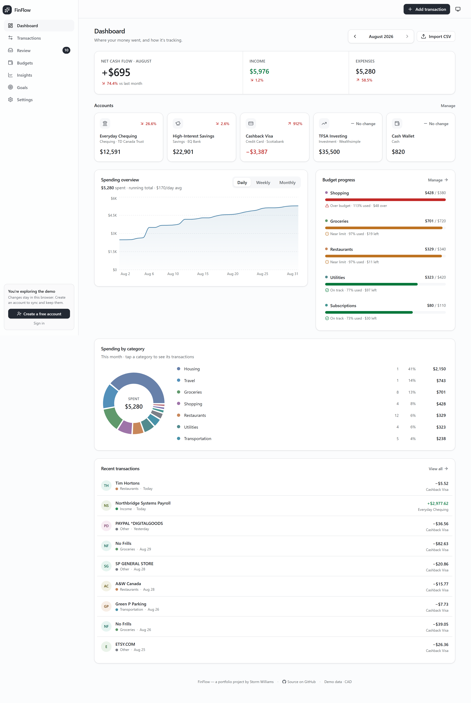
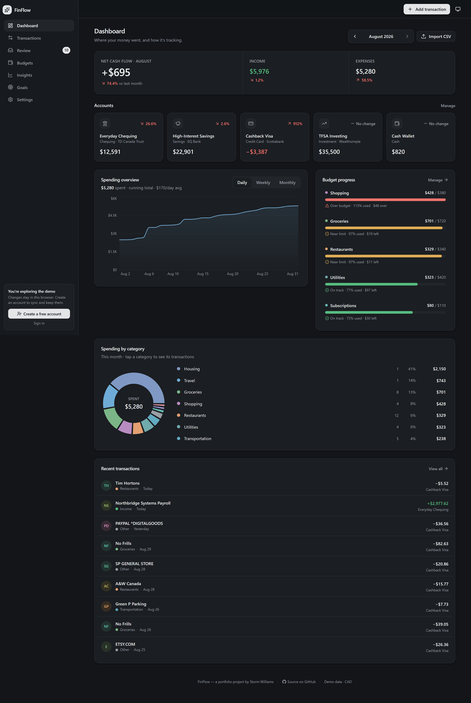
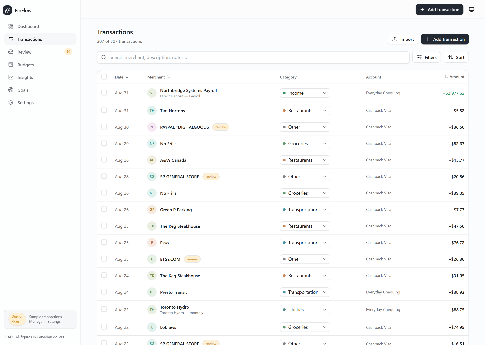
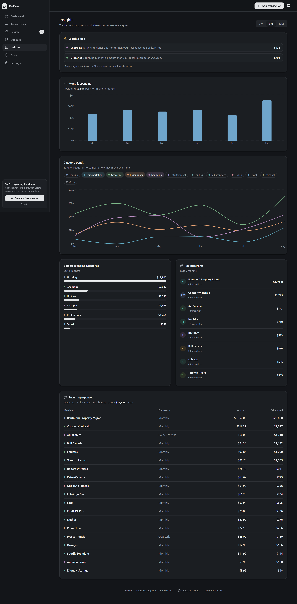

# FinFlow

A personal-finance dashboard with a tested categorization engine, CSV import pipeline, budgets, goals and spending insights. It runs fully in the browser with sample data, and can optionally persist to Supabase with per-user row-level security.

**Live demo:** https://finflow-cyan-theta.vercel.app (opens directly into a seeded demo; data is generated sample data in CAD, changes stay in your browser)

> Portfolio project. No real bank connections, no real users' financial data.

## Screenshots

| | |
| --- | --- |
|  |  |
| **Dashboard**: cash flow, balances, spending, budgets | **Dark mode** |
|  |  |
| **Transactions**: search, filters, inline categorization | **Insights**: trends, recurring charges |

All screenshots use generated sample data.

## Overview
FinFlow imports transactions (manually or from a bank's CSV export), categorizes them automatically, and shows where money went: monthly cash flow, spending by category, budget progress, recurring charges, unusual spending and savings goals. Money is handled in integer cents throughout, and transfers between accounts are excluded from spending.

## Why I Built It
*[Edit in your own words. Suggested:]* I wanted a project where correctness matters more than screens: money math, rules that must not override a user's manual choices, messy CSV input and data that must stay private per user. It let me practice domain modelling, testing pure business logic, and designing one persistence layer that works in several modes.

## Key Features
- **Dashboard:** monthly net cash flow, income/expenses with month-over-month change, account balances, running-total spending chart, category breakdown, budget progress.
- **Transactions:** search, filters, sorting, inline re-categorization, manual add/edit.
- **Automatic categorization:** ~130 built-in Canadian merchant keywords plus user-defined rules with priority and match operators; never overrides a category the user set manually.
- **Review queue:** transactions the engine couldn't confidently categorize.
- **CSV import wizard:** column auto-detection, preview, multi-format date parsing, duplicate detection.
- **Budgets and goals**, **Insights** (merchant stats, recurring-expense detection, anomaly detection, category trends).
- **Accounts + auth:** email/password sign-up, sign-in, password reset (Supabase); guest/demo mode without an account.
- Light/dark theme, responsive layout.

## Architecture
```
                ┌──────────────── Next.js 16 (App Router) ────────────────┐
 Browser ──────►│ UI components (React 19, Tailwind v4, Radix, Recharts)  │
                │        │                                                │
                │   useStore()  ← one persistence interface               │
                │     ├─ guest/local mode ─► localStorage (seeded demo)   │
                │     └─ supabase mode ────► Supabase Postgres (RLS)      │
                │ proxy.ts: refreshes Supabase session cookies (SSR)      │
                └──────────────────────────────────────────────────────────┘
 Pure logic (no React): lib/finance/*  lib/categorization/engine.ts  lib/csv.ts
```
Business logic is kept in framework-free modules so it can be unit-tested; components never know which storage mode is active.

## Technical Highlights
- **Integer-cents money** (`lib/finance/money.ts`): avoids floating-point drift; transfers are excluded from spend and cash-flow math.
- **Categorization engine** (`lib/categorization/engine.ts`): user rules (by priority) → built-in merchant tokens → uncategorized, with a confidence value; whole-token matching avoids false hits.
- **CSV pipeline** (`lib/csv.ts`): header-role guessing, multiple date formats, row validation before import.
- **Duplicate detection:** composite key of date + amount + type + merchant + account. *Known limitation:* two truly identical same-day purchases look like duplicates.
- **Storage seam:** optimistic writes behind one store; local mode needs no backend.
- **Database:** normalized Postgres schema with row-level security on every user table (`supabase/migrations`, 3 migrations); session handling via `@supabase/ssr`.
- Error boundaries and error reporting hooks for graceful failures.

## Testing
`npm test` runs **65 Vitest tests across 8 files** covering money, calculations, dates, filtering, insights, the categorization engine, CSV parsing and import hashing. Last run: 65 passed. GitHub Actions runs lint, tests, `tsc --noEmit` and a Gitleaks secret scan on every push and pull request.
Not covered: UI components, end-to-end flows, and the Supabase mode against a live project (implemented and schema-reviewed, not covered by automated tests). ESLint currently reports 7 warnings and 0 errors.

## Tech Stack
Next.js 16, React 19, TypeScript, Tailwind CSS v4, Radix UI primitives, Recharts, Zod + React Hook Form, PapaParse, Supabase (`@supabase/ssr`, Postgres, RLS), Vitest, GitHub Actions, Vercel.

## Demo
Live: https://finflow-cyan-theta.vercel.app
Run locally (no keys needed):
```bash
npm install
npm run dev      # http://localhost:3000, seeded sample data
npm test
```
To use Supabase, copy `.env.example`, set the two variables and apply `supabase/migrations`.

## Current Status
Completed personal portfolio project. Deployed as a demo. Not a production financial product: no bank aggregation, no encryption beyond Supabase's defaults, not security-audited.

## Future Development
Bank-feed import (Plaid-style), multi-currency, end-to-end tests (Playwright), configurable duplicate detection, receipt attachments.
